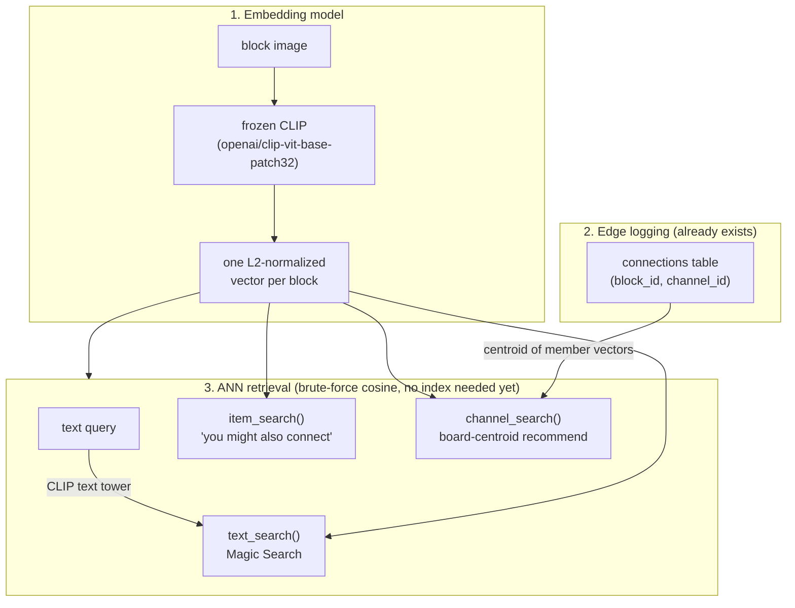

# Recommendation architecture — where Silk actually is vs. the Pinterest lineage

Pinterest's stack (PinSage → PinnerSage → OmniSage, plus the GraphSAGE/PinnerFormer/
multi-stage-retrieval work around it) is the reference architecture for a
moodboard/graph-connection product. This doc maps it onto what exists in *this*
repo today, what's built now, and what's deliberately deferred.

## What exists today

```
are.na crawl (scripts/ingest_arena.ts)
        │
        ▼
Postgres (app/db/schema.ts): users, channels, blocks, connections
        │
        │  connections = one row per (block_id, channel_id) — this table
        │  IS the Pin–Board interaction graph, already logged, nothing to build
        ▼
CSV export (channels.csv, connections.csv, blocks.csv at repo root)
        │
        ▼
ml/  ── retrieve.py           embedding model + ANN retrieval  (this doc)
     └─ finetune_recommend.py fine-tuning on top of it          (parked, see below)
```

`app/` is currently a placeholder React Router shell (`home.tsx` fetches
picsum.photos) — there is no live user-facing Save/Connect feature yet, so
"edge logging" right now means the are.na crawl graph, not real product
interactions. The schema and the retrieval code below are written so that
when real user actions exist, they populate the same shape of table and
nothing downstream has to change.

## The three stages (`retrieve.py`, off-the-shelf CLIP, no fine-tuning)



**Stage 1 — one embedding per item.** `embed_corpus()` runs every block's
image through frozen CLIP once, caches the result (`ml/cache/base_embeddings.pt`).
No text fusion yet — `blocks.csv` only exports `id, image_url` today; `blocks.title`
exists in Postgres but isn't in the CSV export, so image+text fusion (the
OmniSage idea: one vector blending visual + text + engagement) is a small,
clearly-scoped next step, not a redesign.

**Stage 2 — the graph is just `connections`.** No new table, no new logging
code. It's already exactly the Pin–Board bipartite edge list Pinterest builds
PinSage/GraphSAGE on top of. When the app grows a real Save/Connect feature,
those actions should write to a table shaped the same way (`item_id, board_id,
created_at`) — same downstream code, new data source.

**Stage 3 — three retrieval modes, all brute-force cosine similarity** (fine at
this corpus size — ~120K blocks, no ANN index needed until this is 10-100x
larger):

| mode | query | what it stands in for |
|---|---|---|
| `--text` | text → embedding via CLIP text tower | Magic Search |
| `--item <id>` | nearest other blocks | "related pins" / "you might also connect" |
| `--channel <id>` | nearest blocks to the **centroid** of that channel's members, excluding members | board-centroid recommend / "what fits this Web" |

The channel-centroid mode is the simplest possible two-tower model: the
"board tower" is just `normalize(mean(member vectors))`, no separate model to
train. It's the load-bearing MVP piece — it's what makes "related media
across unrelated-looking Webs" (the trail-blazing / rabbit-hole idea in
`Thoughts.md`) start working, since it's reading directly off co-occurrence.

## What's deliberately deferred, and why

| deferred | why not yet |
|---|---|
| Fine-tuning the embedding (`finetune_recommend.py`) | Needs real usage signal to be worth the complexity; base CLIP + channel-centroid already gets most of the value. Kept as a separate, opt-in script — swapping it in later means changing which vectors `retrieve.py` reads, not rewriting retrieval logic. |
| GraphSAGE-style neighborhood aggregation | Only pays off once there's enough graph density that neighborhood structure adds signal beyond content similarity — worth revisiting once `connections` reflects real product usage, not just an are.na crawl snapshot. |
| Multi-interest / sequence user modeling (PinnerSage, PinnerFormer) | There's no per-user save history yet — no users doing anything in-app. Channel-centroid is a fine stand-in until that exists. |
| Ads infra, generative retrieval (PinRec) | Not relevant at this scale or to this product (no ads). |

## Path to production

Everything above runs offline against CSVs on the GPU box. Wiring it into the
live app means:

1. **Store embeddings in Postgres** via `pgvector` — done. `block_embeddings`
   (`block_id`, `space_version`, `embedding vector(512)`, HNSW cosine index)
   lives in `app/db/schema.ts`, kept separate from `blocks` so re-embeds are
   additive, versioned swaps rather than in-place overwrites. Populated in two
   steps, split the same way as `data.export_graph` (GPU box never needs
   `DATABASE_URL`, just images):
   `ml/embed_to_csv.py` (reuses `retrieve.py`'s `embed_corpus()` cache) writes
   `ml/artifacts/<space_version>/embeddings.csv` on the GPU box, then
   `ml/load_embeddings_to_postgres.py` reads that CSV and upserts it by
   `(block_id, space_version)` wherever DB access exists. Default tag:
   `clip-vit-base-patch32_base`.
2. **An API route** doing `ORDER BY embedding <=> $1 LIMIT k` for text→item —
   done, see `app/clip.server.ts` (CLIP text tower via transformers.js,
   `Xenova/clip-vit-base-patch32` — same weights as the Python-side model, so
   the vectors are directly comparable) and `magicSearch()` in
   `app/routes/search.tsx`, which falls back to plain ILIKE text search if
   `block_embeddings` has no rows yet for the current `space_version`.
   Item→item and channel-centroid still only exist in `retrieve.py`'s offline
   demo.
3. **Real edge logging** once Save/Connect exists in the UI — same
   `(item_id, board_id)` shape as `connections`, so retrieval code doesn't
   change, only its data source does. Not started.
